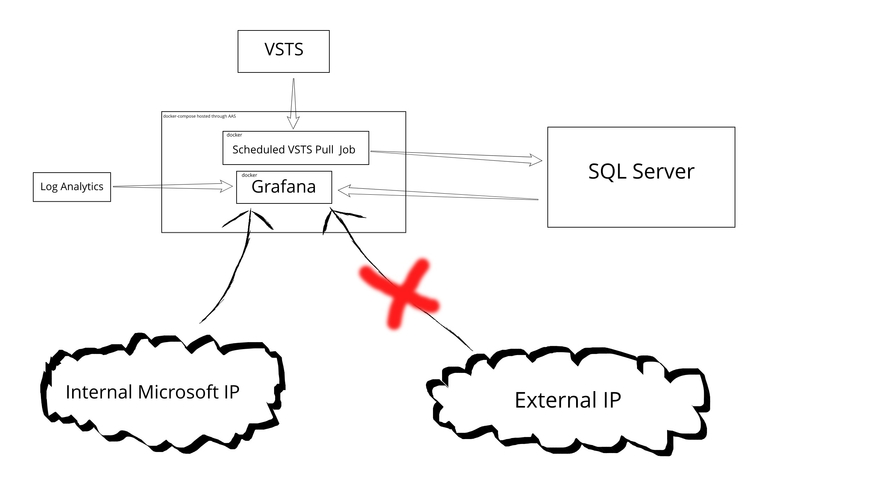

# Test Dashboard

## Goal
Provide unified mechanism for realtime observability of overall test status per branch. Here is a list of the tests we aim to cover:
- Image Build
- Checkin
- CI
- Old E2E
- New E2E
- Stress
- Longhaul
- Connectivity
- Metric KPIs

## Considerations
- Limited Time
- Limited front end experience
- Small amount of progress on azure dev ops api integration made in prior sprints
- Azure Dev Ops API only keeps build for 30 days

## Picking Technologies

The dashboard will involve frontend presentation, a backend service that retrieves data from Azure Dev Ops APIs, and persistence that retains test information past 30 days.

#### Frontend Presentation

##### Option A: Azure Monitor Workbooks
We used azure monitor workbooks (preview) in the past to visualize iotedge metrics information. We could use the same solution here for the test dashboard, however there are significant downsides to this approach. While workbooks provides a first-party solution, I found the editing experience to be quite difficult. Additionally there are features that would be great to have for our test dashboard that are not fully fleshed out in workbooks. Specifically, support is lacking for drill-down workbooks (clickable workbook element opens another workbook) and the dashboard presentation is clunky with a min refresh rate of 30 minutes.

##### Option B: Grafana
Grafana is one of the most commonly used tool for dev ops dashboards. This tool allows a developer to bootstrap a web server hosting a query-backed, panel based GUI customizable interface, which conveniently has integrations with Azure Monitor (needed for connectivity / stress / longhaul results stored in log analytics). Grafana is quite a bit more developed than workbooks which will help to accelerate the development rate and create a polished product with minimal effort. It also positions ourself in the future to migrate our metrics over to Grafana as well, if we want to do that. The biggest detriment to this approach is that Grafana is not a first-party solution, but I think that this is largely mitigated by the fact that the test dashboard won't be customer facing. Another potential detriment is the lack of flexibility 

##### Option C: Custom Solution
We could also roll our own custom solution using frontend technologies like react. This level of customizability does not seem worth the overhead of extra development, especially due to the existing time limitations and my lack of frontend experience.

##### Consensus:
Based on the above analysis, I don't beleive Azure Monitor Workbooks to be a viable option due to the underdeveloped features. I also think rolling our own custom solution is not worth the overhead. Although not first party, Grafana provides everything we need and is free so I believe it is the best choice.

#### Backend Architecture

##### Option A: Pass through API (no storage)
There is a third-party grafana plugin available that supports ajax requests to custom web apis as a datasource. We could implement an api that can communicate with Azure Dev Ops, hit it from grafana, then get back a parsed response containing test status info. Although simplest, this is not desirable because the dashboard won't display history past 30 days, and our release branches sometimes sit that long without updates.

##### Option B: Persistance with scheduled job
Grafana has datasource support for most SQL variants (SQL queries back the presentation data directly). This means that as long as the store is up to date, every request to grafana won't need to rely upon a call to vsts. This synchronization can be provided by scheduling a (dotnet) job every few minutes that will retrieve data from vsts and populate the store. This approach allows storing historical information at the cost of extra setup and a small data ingestion time delay.

##### Consensus:
Option B seems like the better choice it allows us to store historical information while not relying on third non-native plugins. 

## Hosting
For persistence we can host SQL Server on azure, remotely accessible by our grafana server. We can then create a docker compose which can spin up two containers: Grafana and our scheduled dotnet service. We can then use Azure App Service to spin up our docker compose. This is desirable because we won't have the overhead of managing deployments. 

## Architecture Diagram

## Frontend Layout
The home page will show one grid of build, test, kpi pass/fail indicators per branch. These will be clickable, opening up a separate dashboard, allowing users to get granular information surrounding the pass/fail. For stress and longhaul this drill-down is essential as the vsts pipeline only displays initial deployment status. For connectivity, this is also essential as the test result result information is difficult to visually parse from the vsts logs. For CI, E2E, and image builds, a deep link to the vsts build can display all the information necessary. Although, if we want to track failure details past 30 days of history then we should either store relevant information or simply increase the Azure Dev Ops retention period. Managing the retention period of builds should be treated with lower priority. Connectivity, longhaul, and stress are more important since there is no clean way to view these results.

I have mock ups for how I want this to look, but as I learn more about Grafana this is going to change significantly. I think the best plan is to agree on the above high-level concept and sync regularly to get presentation layer feedback.

## Approach
Due to time restrictions, we should build the dashboard in iterations:

1. Set up our SQL Server instance on Azure
2. Set up Azure App Service to deploy our Grafana App and scheduled dotnet service
3. Display simple pass / fail for each test type for the master branch. 
4. Display more branches
5. Display data describing test failure 
6. Display historical test information
